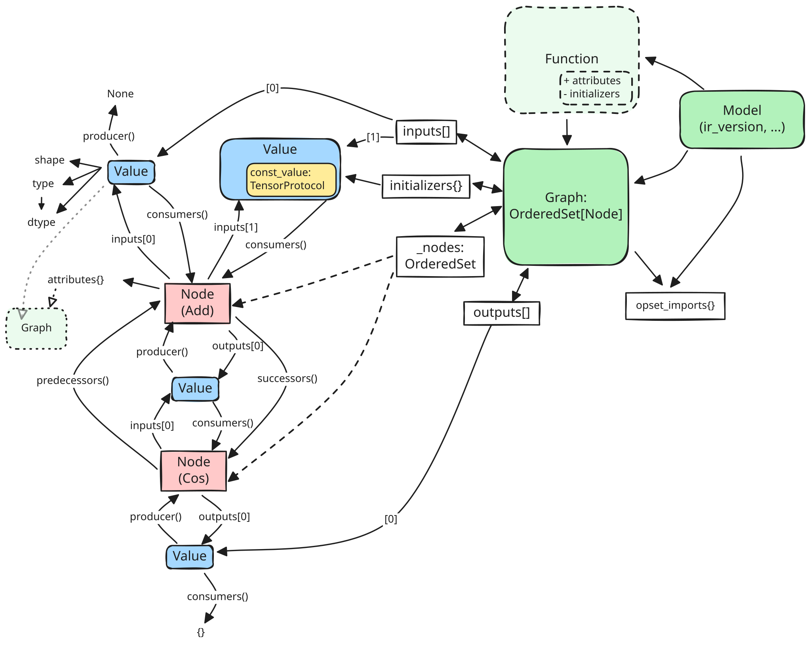

# Introduction to the IR

ONNX IR is an in-memory representation of ONNX models for graph construction,
analysis, and transformation. It represents the full ONNX specification while
providing Python-native objects and mutation APIs that are more convenient than
editing protobuf messages directly.

This page explains the IR's design principles, object model, and major features.
For a hands-on walkthrough, see [Getting started with ONNX IR](getting_started.ipynb).

## Design principles

### Preserve the ONNX model

The IR maps closely to ONNX concepts so models can be loaded, inspected, changed,
and serialized without losing information. It supports all valid ONNX models and
also permits some temporarily invalid states, which is useful when a transformation
needs several steps to repair or rewrite a graph.

### Make graph relationships explicit

Connections are represented by object references instead of repeated string
lookups. A {py:class}`onnx_ir.Value` knows its producer and consumers, a
{py:class}`onnx_ir.Node` owns its output values, and a
{py:class}`onnx_ir.Graph` owns an ordered collection of nodes. These relationships
make common analysis and rewriting operations direct and efficient.

### Support safe, local mutation

Graph edits update the relevant ownership and use-def relationships. The graph's
node container supports insertion and removal during iteration, so transformation
passes can edit a graph without first copying its node list.

Nodes are stored in a deterministic order, but the IR does not automatically
topologically sort them. Transformations are responsible for preserving or
restoring topological order when required.

### Separate representation from serialization

ONNX protobuf is an interchange format; it does not need to be the working data
structure. After deserialization, the IR can be used without manipulating protobuf
objects. Serialization and deserialization are explicit boundaries through
functions such as {py:func}`onnx_ir.load`, {py:func}`onnx_ir.save`,
{py:func}`onnx_ir.from_proto`, and {py:func}`onnx_ir.to_proto`.

### Avoid unnecessary tensor copies

Tensor data is accessed through {py:class}`onnx_ir.TensorProtocol`, which allows
the IR to work with different storage backends through one interface. Implementations
include in-memory arrays, protobuf-backed tensors, memory-mapped external tensors,
lazy tensors, and packed low-bit tensors.

## Object model



### Model

A {py:class}`onnx_ir.Model` is the top-level container. It holds:

- the main graph;
- the ONNX IR version;
- producer, domain, version, and documentation information;
- model-local functions;
- serializable metadata and multi-device configuration.

### Graph

A {py:class}`onnx_ir.Graph` represents a computation and behaves as a sequence of
nodes. It also owns graph inputs, graph outputs, initializers, and opset imports.
Subgraphs stored in node attributes use the same graph representation.

Use a {py:class}`onnx_ir.GraphView` when an analysis needs a read-only view over a
subset of nodes. A view does not copy or take ownership of its nodes, and changes
to the underlying connections remain visible through the view.

#### Ownership and graph invariants

The IR maintains ownership and use-def relationships as graph objects are edited:

- A node belongs to at most one graph. Remove it from its current graph before
  inserting it into another one.
- A node owns its output values. Each output therefore has exactly one producer.
- Graph and function inputs have no producer.
- An initializer must be named, have a constant value, and have no producer.
- Graph outputs reference existing values; they are not a separate copy of those
  values.

Use `graph.remove(nodes, safe=True)` for removal. Safe removal rejects nodes whose
outputs are still used or contribute to graph outputs, then detaches the removed
nodes from their inputs so use-def information remains consistent.

Node order is deterministic but is not automatically topological. Call
`graph.sort()` after a rewrite when the transformation does not naturally preserve
topological order. The stable sort also processes nested subgraphs and raises
`ValueError` if it finds a cycle.

#### Views and clones

A {py:class}`onnx_ir.GraphView` provides a fixed, read-only topology over existing
nodes and values. It is useful for analysis or serialization of a region without
copying that region.

Use `graph.clone()` or `model.clone()` when the result must be independently
mutable. Cloning creates new graph, node, and value objects while sharing tensors
used by initializers and constants. Pass `deep_copy=True` to also deep-copy
analysis metadata stores. When cloning a nested graph independently, set
`allow_outer_scope_values=True` if its captured outer-scope values should remain
shared.

### Node

A {py:class}`onnx_ir.Node` represents an operator invocation. It stores the
operator domain, type, overload, attributes, inputs, and output values. Node
inputs may be replaced, while output values are fixed when the node is created.
To replace outputs, create a new node and redirect uses of the old values.

Nodes also provide direct graph-neighbor traversal. `predecessors()` returns the
nodes that produce the node's inputs, while `successors()` returns the nodes that
consume its outputs. Both results are deduplicated and have deterministic order:

```python
predecessors = node.predecessors()
successors = node.successors()
```

### Value

A {py:class}`onnx_ir.Value` represents data flowing through the graph. A value can
be a graph input, initializer, node output, or graph output, and may carry type,
shape, constant data, documentation, and metadata.

Every value has at most one producer and can have many uses. The producer/use
links support both directions of graph traversal:

```python
producer = value.producer()
consumers = list(value.consumers())
uses = list(value.uses())  # Each use includes the node and input index.
```

### Types, shapes, tensors, and attributes

{py:class}`onnx_ir.Value` objects carry ONNX types such as tensor, sparse tensor,
sequence, and optional types. Tensor shapes are represented by
{py:class}`onnx_ir.Shape` and may contain static integer dimensions or shared
{py:class}`onnx_ir.SymbolicDim` objects. A symbolic dimension can store a SymPy
expression, enabling shape arithmetic that can later be evaluated with concrete
symbol bindings:

```python
import sympy

import onnx_ir as ir

batch = sympy.Symbol("batch", integer=True, positive=True)
shape = ir.Shape(
    [
        ir.SymbolicDim(batch),
        ir.SymbolicDim(batch * 2 + 1),
    ]
)
concrete_shape = shape.evaluate({"batch": 4})  # Shape([4, 9])
```

Constant data uses the {py:class}`onnx_ir.TensorProtocol` interface. Operator
attributes use {py:class}`onnx_ir.Attr` and can contain scalar values, sequences,
tensors, graphs, types, and ONNX function attribute references.

### Subgraphs and functions

Control-flow operators store subgraphs in node attributes. A subgraph can
implicitly capture values from an enclosing graph in addition to declaring its own
inputs, initializers, and outputs. Each graph also carries its own opset imports.
Use {py:class}`onnx_ir.traversal.RecursiveGraphIterator` or `graph.all_nodes()` to
visit nodes in nested subgraphs.

A {py:class}`onnx_ir.Function` defines a reusable, model-local operator identified
by `(domain, name, overload)`. Like a graph, it owns inputs, outputs, nodes,
attributes, and opset imports. Functions are stored separately from the main graph,
so analyses and transformations that apply to the whole model should process both:

```python
for node in model.graph.all_nodes():
    analyze(node)

for function in model.functions.values():
    for node in function.all_nodes():
        analyze(node)
```

### Names and identity

Objects are connected by identity, not by their names. Names are primarily for
serialization, diagnostics, and lookup.

When an unnamed node is added to a graph, the graph assigns names such as
`node_Relu_0`; unnamed outputs receive names such as `val_0`. Explicit names are
preserved, even if they collide, so callers remain responsible for the uniqueness
of names they provide. Automatically generated names are reserved for the lifetime
of the graph and are not reused after removal.

Run {py:class}`onnx_ir.passes.common.NameFixPass` when an imported or transformed
model may contain missing or duplicate names. It handles nested graph scopes,
updates initializer mappings, and processes model-local functions:

```python
import onnx_ir.passes.common as common_passes

result = common_passes.NameFixPass()(model)
model = result.model
```

Pass a custom `NameGenerator` to `NameFixPass` when generated names should follow
a project-specific convention.

Renaming an initializer also requires updating the graph's initializer mapping.
Use {py:func}`onnx_ir.convenience.rename_values` for collision-aware bulk renaming
that handles initializer bookkeeping when only selected values should change.

## Major features

### Full ONNX coverage

The IR represents models, graphs, functions, nested subgraphs, opset imports,
attributes, type and shape information, metadata properties, external tensor data,
and newer model features such as multi-device configuration.

### Use-def tracking

Producer and consumer information is maintained by the IR. Rewriters can inspect
uses, replace node inputs, replace all uses of a value, and safely check whether a
node can be removed.

### Robust graph editing

Graphs provide methods to append, insert, remove, and reorder nodes. Iterators
remain usable while nodes are inserted or removed, enabling single-pass
transformations. Higher-level helpers for common rewrites are available in
{py:mod}`onnx_ir.convenience`.

### Flexible tensor storage

Tensor implementations can wrap NumPy-compatible arrays without an eager protobuf
conversion. External tensors use memory mapping to avoid loading entire weight
files into memory, and custom tensor implementations can implement
{py:class}`onnx_ir.TensorProtocol` to integrate other storage systems.

See [Tensor Representation in the IR](tensors.md) for details.

### Serializable and analysis-only metadata

IR objects expose two metadata stores:

- `metadata_props` contains string key-value pairs that are serialized to ONNX.
- `meta` contains arbitrary Python objects for analyses and transformations and
  supports invalidation when cached information must be recomputed.

Keeping these stores separate lets passes attach rich intermediate state without
accidentally changing the serialized model.

### Pythonic APIs

Core entities use standard Python collection interfaces: graphs and functions are
node sequences, attributes and initializers are mapping-like containers, and graph
inputs and outputs are mutable sequences. Convenience constructors such as
{py:func}`onnx_ir.node`, {py:func}`onnx_ir.val`, and {py:func}`onnx_ir.tensor`
reduce boilerplate when constructing models.

## Where to go next

- [Getting started with ONNX IR](getting_started.ipynb) for loading and exploring
  a model.
- [Graph transformation patterns](graph_transformations.md) for common rewrites.
- [Writing transformation passes](writing_passes.md) for reusable transformations.
- [Model I/O and external data workflows](model_io.md) for serialization.
- [API Reference](api/index.md) for the complete public API.
